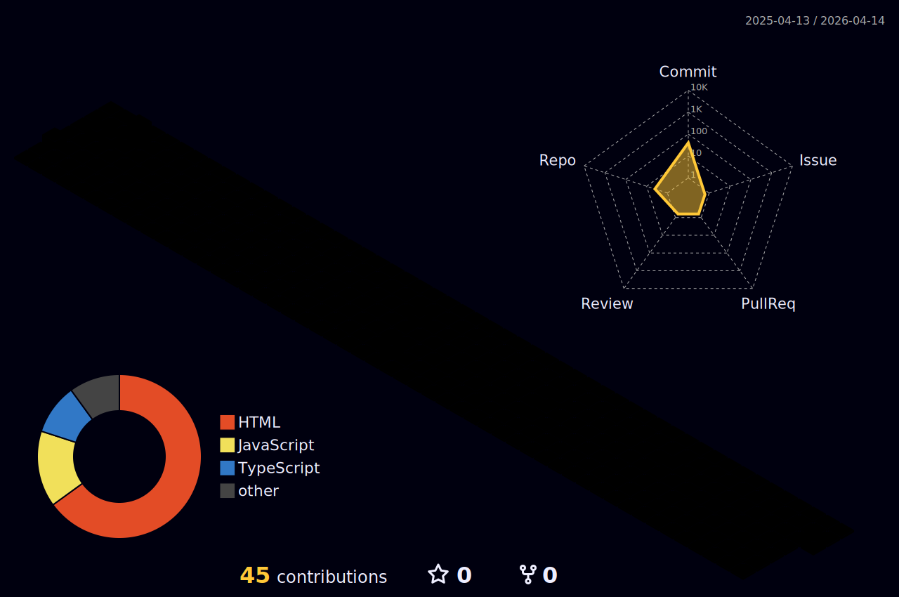

 

---

### ◈ About

Fullstack developer and AI researcher building at the intersection of **intelligent systems, computer vision, and applied security**. I build things that work at scale — from ML inference pipelines on Azure to multi-agent AI assistants with RAG over 487K+ CVEs.

Finishing a Dual B.S. in **Computer Science & AI** (Cybersecurity Minor) at Drake University — Summa Cum Laude, 4.0 GPA. Published at **UCNC 2025 (Springer LNCS)**. Founding member of Drake Cyber Club.

---

### ◈ Now

- 🔬 **[VenomX](https://kmoh.dev)** — AI pentesting assistant with 8 specialist agents & RAG over 487K+ CVEs. Presented at CCSC 2026.
- 📡 **SPECTRE** — Hybrid spatial positioning fusing cameras + BLE beacons for real-time multi-person tracking.
- 🧠 Exploring: advanced multi-agent orchestration, synthetic data generation, and LLM security research.
- 🤝 Open to collaborating on AI security tools and open-source ML infrastructure.

---

### ◈ Stack

**Languages**

**Frontend & Frameworks**

**AI / ML**

**Data & Cloud**

---

### ◈ Stats

 

---

